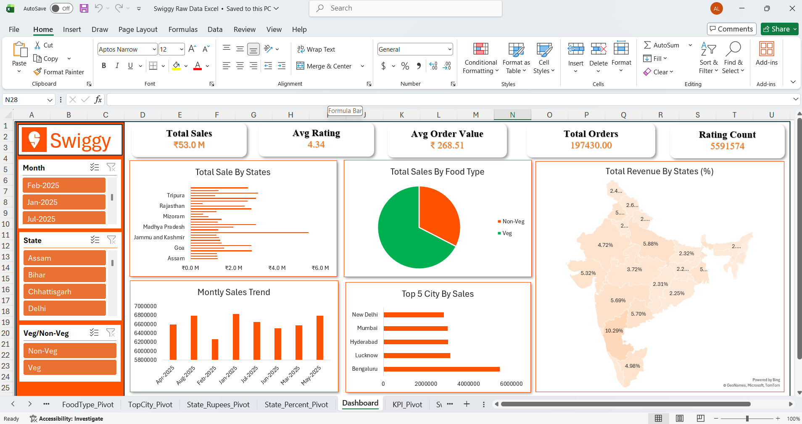

# Swiggy Sales Dashboard — Excel

**Tools:** Microsoft Excel, Pivot Tables, Power Query, Slicers, Map Charts
**Dataset:** Public Swiggy sales dataset (Kaggle)

### Problem
Food delivery businesses generate huge volumes of order-level data, but raw spreadsheets don't tell decision-makers where sales are strong, where they're weak, or how performance is trending month to month. The goal of this project was to turn a raw Swiggy sales dataset into an interactive dashboard that a business team could actually use to spot patterns and make decisions — without needing to touch a single formula.

### Approach
1. **Data cleaning:** Used Power Query to clean and standardize the raw dataset — handling inconsistent state names, missing values, and duplicate order entries.
2. **Data modeling:** Built multiple Pivot Tables (state-wise sales in rupees and percent, top-city rankings, KPI summary) across dedicated pivot sheets to keep the dashboard fast and organized.
3. **Visualization:** Designed a single-page interactive dashboard combining:
   - Five KPI cards — Total Sales, Avg Rating, Avg Order Value, Total Orders, and Rating Count
   - A horizontal bar chart of total sales by state
   - A pie chart comparing Veg vs. Non-Veg sales
   - A monthly sales trend bar chart
   - A "Top 5 Cities by Sales" ranked bar chart
   - A choropleth-style map of India showing revenue share (%) by state
4. **Interactivity:** Added slicers for Month, State, and Veg/Non-Veg so any chart on the dashboard can be filtered instantly.

### Key Metrics Surfaced
- **Total Sales:** ₹53.0M
- **Average Rating:** 4.34
- **Average Order Value:** ₹268.51
- **Total Orders:** 197,430
- **Rating Count:** 5,591,574

### Insight & Impact
The state-wise bar chart and revenue map together made it easy to spot that a small handful of states drove a disproportionate share of revenue, while the Top 5 Cities chart showed which specific cities were outperforming their states' averages — the kind of drill-down that would take hours to piece together manually in a raw spreadsheet. The monthly trend chart also surfaced clear month-to-month swings, useful for spotting seasonal demand shifts, and the Veg/Non-Veg split gave a quick read on menu-category performance.

### What I'd Do Next
Add a cohort-style repeat-order analysis to distinguish new customer growth from repeat customer loyalty — something the current dataset doesn't fully capture but would meaningfully deepen the business insight.
